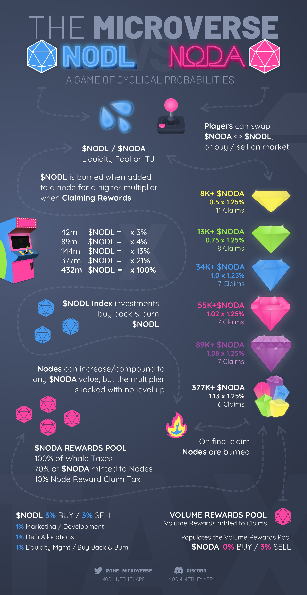

# Brand Assets


**The Microverse Brand Asset Usage:** Please follow the guidelines for use of our brand assets when sharing The Microverse.


## Logos

## Icons
Width / File Type | $NODL | $NODA | NODN
--- | --- | --- | ---
1200 x 1200px PNG Transparent Background |  |  | 
1200 x 1200px JPG White Background |  |  | 
SVG Transparent Background |  |  | 
PDF Transparent Background | [Blue ten sided 2d geometric shape.](../.gitbook/assets/nodl-icon.pdf) | [Pink ten sided 2d geometric shape.](../.gitbook/assets/noda-icon.pdf) | [Black ten sided 2d geometric shape.](../.gitbook/assets/nodn-icon.pdf)

## Visuals & Infographics

### The Microverse: Generic Banner
```
V1.0 — Initial Release
```

For use as a static or animated (MP4) landscape visual to promote The Microverse (Facebook/Twitter/etc). This can be considered the default promotional visual for The Microverse.

[🔻 Click to download 2880x1620px JPG: the-microverse-nodl-noda-16x9.jpg](https://github.com/Nodinverse/NODLvsNODA/blob/d472bfaf906df81087b762f0987357df34edcc0a/.gitbook/assets/the-microverse-nodl-noda-16x9.jpg?raw=true "Click to download directly")

[🔻 Click to download 1080p MP4: the-microverse-nodl-noda-16x9.mp4](https://github.com/Nodinverse/NODLvsNODA/blob/d472bfaf906df81087b762f0987357df34edcc0a/.gitbook/assets/the-microverse-nodl-noda-16x9.mp4?raw=true "Click to download directly")


### NODN NFT Nodes
```
V1.13 — Updated multipliers
```

[🔻 Click to download 2880p x 1620px JPG: nodn-nft-nodes.jpg](https://github.com/Nodinverse/NODLvsNODA/blob/f60e50864aca3de5caf312cdec9d84389cfc781d/.gitbook/assets/nodn-nft-nodes.jpg?raw=true "Click to download directly")


### The Microverse Overview
```
V1.3 — NODL Multipliers update. NODA sell tax update.
```

[🔻 Click to download 1920px JPG: the-microverse-overview.jpg](https://github.com/Nodinverse/NODLvsNODA/blob/f60e50864aca3de5caf312cdec9d84389cfc781d/.gitbook/assets/the-microverse-overview.jpg?raw=true "Click to download directly")


