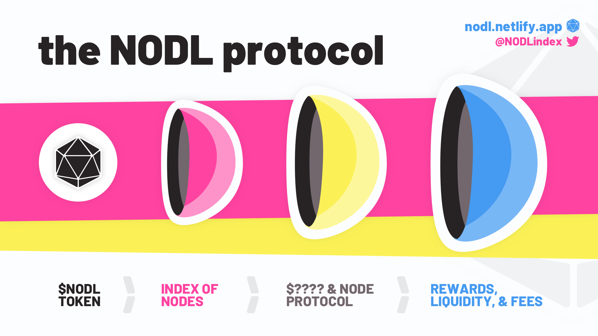

# $NODL Overview


**Good to know:** $NODL represents the treasury and growth of The Microverse. Fixed supply will be 100 Billion Coins (100,000,000,000). This supply will decrease as burning regularly occurs. **$NODL is a tokenized representation of the treasury and growth of the protocol.**&#x20;


**Current Supply: 92 Billion (8% has been burned -> TXs in our** [**Discord**](../appendix/official-links.md)**)**&#x20;

**Max Wallet Size:** 7.5 Billion coins

**Max Swap (buy/sell order):** 1.25 Billion

Set Slippage to **7.111%** or **more**

As the treasury increase the size and use of its resources and more $NODL are added to nodes the circulating supply will decrease. As the coin flows of the index exceed the sell pressure of $NODL it will result in buying (and burn) pressure on $NODL. The index (with its coin flows) and the protocol fees will all contribute to buy backs.

